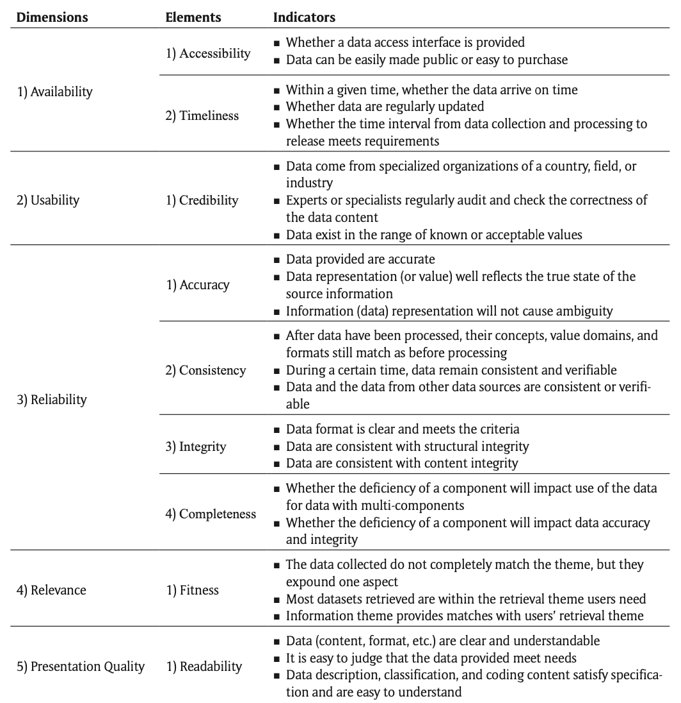
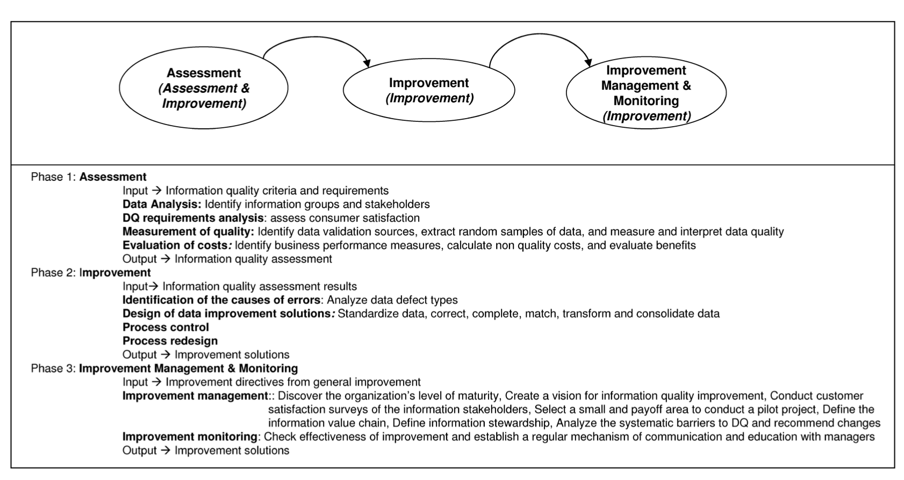
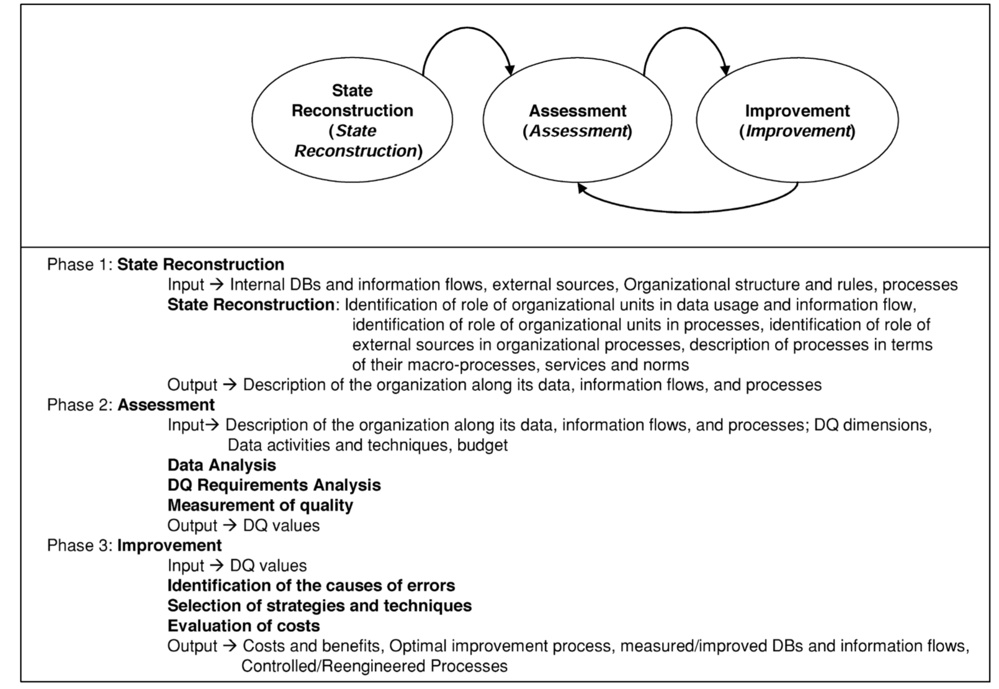

# Seminar Template
LaTeX-Template for seminar papers

# 1. Introduction

The rest of the paper is structured as follows: Data Quality Fundamentals, Related Works, Evaluation and Conclusion.

For the first section, the fundamental of data quality are introduced, which include
an overview of data quality and their attributes and classification of data quality assessment methods.   
In second section, literature review of five data quality assessment are presented and important concept from different paper are explained in brief. 
In the third part, evaluation on these five methods is performed in terms of steps, process, strategies, techniques, cost and performance.
In the end of paper, a conclusion is made based on evaluation result in the context of CI/CD application in software engineering. 
The proposed method, future work and challenges are discussed in brief.

# 2. Data Quality Fundamentals

The section introduces the basic data quality issues common to all methodologies, which represent the perspectives used in this article for comparative analysis such as:
(1) the methodological phases and steps, 
(2) the strategies and techniques, 
(3) the data quality dimensions, 
(4) the types of data

## Data Type

The ultimate goal of a DQ methodology is the analysis of data that, in general, describe real world objects in a format that can be stored, retrieved, and processed by a software procedure, and communicated through a network. 
In the field of data quality, most authors either implicitly or explicitly distinguish three types of data:

- Structured data, is aggregations or generalizations of items described by elementary attributes defined within a domain. 
Domains represent the range of values that can be assigned to attributes and usually correspond to elementary data types of programming languages, such as numeric values or text strings. 
Relational tables and statistical data represent the most common type of structured data.

- Unstructured data, is a generic sequence of symbols, typically coded in natural language. 
Typical examples of unstructured data are a questionnaire containing free text answering open questions or the body of an e-mail.

- Semistructured data, is data that have a structure which has some degree of flex- ibility. Semistructured data are also referred to as schemaless or self-describing. 
 XML is the markup language commonly used to represent semistructured data. 
 Some common charac- teristics are: 
 (1) data can contain fields not known at design time; for instance, an XML file does not have an associated XML schema file; 
 (2) the same kind of data may be represented in multiple ways; for example, a date might be represented by one field or by multiple fields, even within a single data set; and 
 (3) among the fields known at design time, many fields will not have values.
 
 
 Data quality techniques become increasingly complex as data lose structure. For ex- ample, let us consider a registry describing personal information such as Name, Surname, Region, and StateOfBirth. Figure 2 shows the representation of Mr. Patrick Metzisi, born in the Masai Mara region in Kenya, by using a structured (Figure 2(a)), unstruc- tured (Figure 2(b)), and semistructured (Figure 2(c)) type of data. The same quality dimension will have different metrics according to the type of data. For instance, syn- tactic accuracy is measured as described in Section 2.3 in the case of structured data. With semistructured data, the distance function should consider a global distance re- lated to the shape of the XML tree in addition to the local distance of fields.
 The large majority of research contributions in the data quality literature focuses on structured and semistructured data. For this reason, although we acknowledge the relevance of unstructured data, this article focuses on structured and semistructured data.
 
  
 Different representations of the same real-world object.

## Data Quality Dimensions
Framework
  
  
 

- Accessibility
- Timeliness
- Authorization
- Credibility
- Definition/Documentation
- MetaData
- Accuracy
- Consistency
- Integrity
- Completeness
- Auditability
- Fitness
- Readability
- Structure
# Literature Review

In this section, 3~5 data quality assessment methods are introduced in brief:

## Total Data Quality Management(TDQM)
 

Total Information Quality Management(TIQM), 

The TIQM methodology [English 1999] has been designed to support data warehouse projects. 
The methodology assumes the consolidation of operational data sources into a unique, integrated database, used in all types of aggre- gations performed to build the data warehouse. 
This consolidation eliminates errors and heterogeneities of source databases. 
TIQM focuses on the management activities that are responsible for the integration of operational data sources, by discussing the strategy that has to be followed by the organization in order to make effective technical choices. 
Cost-benefit analyses are supported from a managerial perspective. The methodology provides a detailed classification of costs and benefits (see Section 3.4).

 

## Data Quality Assessment(DQA), 

## Information Quality Measurement(IQM), 

General description. The fundamental objective of the IQM methodology [Eppler and Mu ̈nzenmaier 2002] is to provide an information quality framework tailored to Web data. 
In particular, IQM helps the quality-based selection and personalization of the tools that support Webmasters in creating, managing, and maintaining Web sites.
Detailed comments. The IQM methodology provides guidelines to ensure that software tools evaluate all the fundamental information quality dimensions. 
The methodology provides two sets of guidelines: the information quality framework defining quality criteria, and the action plan explaining how to perform quality measurements.
The main phases of IQM methodology are reported in Figure 13. The first phase de- fines the measurement plan. 
The information quality framework is defined as a list of relevant information quality criteria identified by interviewing the information stake- holders. 
The framework is the input for an information quality audit that associates the information quality criteria with the methods and tools that will be used in the measurement process. 
Some criteria require multiple measurement methods. The IQM methodology coordinates the application of multiple measurement methods.

## Comprehensive methodology for Data Quality management(CDQ).

 
 
General description. The CDQ methodology [Batini and Scannapieco 2006; Batini et al. 2008] is conceived to be at the same time complete, flexible, and simple to apply. 
Completeness is achieved by considering existing techniques and tools and integrating them in a framework that can work in both intra- and inter-organizational contexts, and can be applied to all types of data, structured, semistructured and unstructured. 
The methodology is flexible since it supports the user in the selection of the most suitable techniques and tools within each phase and in any context. 
Finally, CDQ is simple since it is organized in phases and each phase is characterized by a specific goal and set of techniques to apply.

The CDQ methodology is innovative since it provides support to select the optimal quality improvement process that maximizes benefits within given budget limits. 
Second, it emphasizes the initial requirements elicitation phase. In fact, the other methodologies implicitly assume that contextual knowledge has been previously gathered and modelled. 
The focus is on how to reach total data quality without providing indications as to how to use contextual knowledge. 
A goal of CDQ is instead to obtain a quantitative assessment of the extent to which business processes are affected by bad information.

Detailed comments. Three main phases characterize the methodology: state reconstruction, assessment, and choice of the optimal improvement process (see Figure 20). 
In the first phase of the methodology, the relationships among organizational units, processes, services, and data are reconstructed. 
These relationships are modelled by using matrixes that describe which organizational units use data and their roles in the different business processes. 
Furthermore, in this phase, processes are described along with their contribution in the production of goods/services and the legal and organizational rules that discipline workflows. 
The second phase sets new target quality levels that are needed to improve process qualities, and evaluates corresponding costs and benefits. 
This phase locates the critical variables affected by poor quality. Since improvement activities are complex and costly, it is advisable to focus on the parts of the databases and data flows that raise major problems. 
Finally, the third phase consists of five steps and is aimed at the identification of the optimal improvement process: the sequence of activities that has the highest cost/effectiveness ratio. 
New target quality levels are set by considering costs and benefits. Different improvement activities can be performed to reach new quality targets. 
The methodology recommends the identifica- tion of all the data-driven and process-driven improvement techniques for the different databases affected by poor quality. 
A set of mutually consistent improvement tech- niques constitutes an improvement process. 
Finally, the most suitable improvement process is selected by performing a cost-benefit analysis.

# Conclusions

## Challenges
可以參考The Challenges of Data Quality and Data Quality Assessment in the Big Data Era